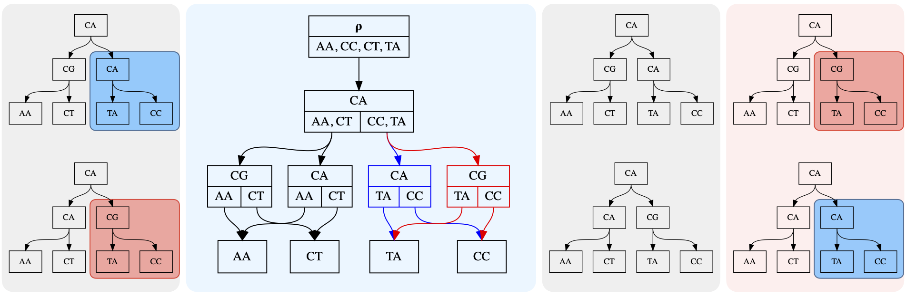

.. currentmodule:: historydag

Quickstart
##########

This document provides a conceptual introduction to the history DAG data
structure, and provides a walk-through of essential features of the package.

The data structure
==================
A history DAG is a way to represent a collection of trees whose nodes
(including internal nodes) each carry label data, such as a nucleotide
sequence.

In its simplest form, a history DAG may represent a single tree. To construct
such a history DAG from a tree, we annotate each node in the tree with its
child clades. The **clade** beneath a tree node is the set of leaf node labels
reachable from that node, or the set containing the node's own label if it is
itself a leaf. We also refer to this set as a node's **clade union**, since it
is the union of the node's child clades. The **child clades** of a node are the
set of clades beneath that node's children.

After annotating each node with its child clades, a **UA (universal ancestor)
node** is added as a parent of the original tree's root node. The resulting
structure is an example of a history DAG which we call a **history**:

|pic1| -> |pic2|

.. |pic1| image:: figures/history_0.svg
   :width: 45%

.. |pic2| image:: figures/fulltree_0.svg
   :width: 45%

Notice that edges in the history DAG are associated not just to a parent node,
but to a specific child clade of their parent node. The child clade of the
parent node associated to an edge, must be the same as the clade below the
child node that the edge targets.

After converting multiple trees with the same set of leaf labels to clade
trees, those histories can be unioned to create a history DAG that represents
at least those trees used to create it. Any structure in the resulting history
DAG which contains the UA node and all leaves, and has exactly one edge for
each node-child clade pair, is a history. Histories represent labeled
trees by the inverse of the correspondence introduced above:

For example, the history highlighted in red in this image:

.. image:: figures/history_dag_example.svg
   :width: 100%

represents this internally labeled tree:

.. image:: figures/history.svg
   :width: 50%

A history DAG in general represents more trees than used to construct it, since
it automatically represents trees resulting from swapping certain substructures
between input trees. The following figure illustrates a simple example of this,
with the two input trees on the left panel yielding a history DAG which
represents the original two trees, as well as two new trees shown in the right
panel.

Installing
==========

Although the package is not on PyPI, installation is straightforward:

.. code-block:: console

   pip install https://github.com/matsengrp/historydag/archive/refs/heads/main.zip

Alternatively, clone the repository and install:

.. code-block:: console

   git clone https://github.com/matsengrp/historydag.git
   pip install historydag/

Loading Tree Data
=================

:class:`HistoryDag` objects can be created from tree data using the functions
:meth:`from_tree` to create a tree-shaped history DAG (a 'history'), or :meth:`history_dag_from_trees`,
to create a history DAG from many trees.

Each :class:`HistoryDagNode` stores node data in two ways: the ``label``
attribute stores a :class:`typing.NamedTuple` whose data is used to distinguish
``HistoryDagNode`` instances, and the ``attr`` attribute stores
all other node annotations not to be used to distinguish node instances.

The functions :meth:`from_tree` and :meth:`history_dag_from_trees` provide an
interface for mapping node data in the provided tree data structures to the
appropriate place in the :class:`HistoryDagNode` data structure.

For example, let's load some sample trees provided in the [historydag
repository](https://github.com/matsengrp/historydag):

>>> import historydag as hdag
>>> import pickle
>>> with open('historydag/sample_data/toy_trees.p', 'rb') as fh:
...     ete_trees = pickle.load(fh)

Now, we will create a history DAG using the ``sequence`` attribute as the data
for node labels:

>>> dag = hdag.history_dag_from_trees(ete_trees, ['sequence'])

The second argument to :meth:`history_dag_from_trees` is a list of node
attribute names in the provided data structure, which should be included as
attributes with the same name in node labels in the resulting history DAG.

We can also map node sequences to a history DAG node label attribute of
a different name, using the keyword argument ``label_functions``:

>>> dag = hdag.history_dag_from_trees(
...     ete_trees,
...     [],
...     label_functions={'original_seq': lambda node: node.sequence}
... )

The data stored in each ete3 tree node's ``sequence`` attribute will now appear in
history dag node label attribute ``original_seq``.

Finally, we can also map data from the input trees to the history dag nodes'
``attr`` attribute, which is preserved on copy and by all ``HistoryDag``
operations which do not merge or overwrite nodes.

By providing a function taking a node in the input data structure,
and returning the value of the corresponding ``HistoryDagNode`` instance's
``attr`` attribute.

For example, here we map ``name`` attributes to the ``attr`` attribute of DAG
nodes:

>>> dag = hdag.history_dag_from_trees(
...     ete_trees,
...     [],
...     label_functions={'original_seq': lambda node: node.sequence},
...     attr_func=lambda node: node.name
... )

Loading Non-ete3 Tree Data:
---------------------------

The functions :meth:`from_tree` and :meth:`history_dag_from_trees` accept tree
data in the form of :class:`ete3.Tree` objects by default, but arbitrary tree
data structures can be loaded by providing appropriate functions to the keyword
arguments `child_node_func` and `leaf_node_func`.

``child_node_func`` must be a function accepting a node of an input tree, and
returning an iterable containing all the child nodes of that tree.

``leaf_node_func`` must be a function accepting a node of an input tree, and
returning an iterable containing all the leaf nodes reachable below that node.

For example, given a :class:`dendropy.TreeList` object, with each tree node's
sequence stored in the ``sequence`` record of that node's ``annotations``
attribute (a :class:`dendropy.AnnotationSet`), we can create a history DAG
which contains these sequences stored in the node label attribute ``sequence``:

>>> dag = hdag.history_dag_from_trees(
...     [tree.seed_node for tree in treelist],
...     [],
...     label_functions={'sequence': lambda node: node.annotations.get_value('sequence')},
...     child_node_func=dendropy.Node.child_nodes,
...     leaf_node_func=dendropy.Node.leaf_iter
... )

Loading newick tree data:
-------------------------

The function :meth:`history_dag_from_newick` can be used to load a history DAG
from a list of newick strings. However, this method uses ete3 internally for
newick parsing.

Basic HistoryDag operations
===========================

Sampling, Indexing, and Iterating Over Histories
------------------------------------------------

:class:`HistoryDag` objects are iterable containers of histories that support integer
indexing via ``[]``, and can be passed to ``len``.

Indexing a :class:`HistoryDag` object will return a tree-shaped HistoryDag (a
history, or equivalently a history DAG containing a single history):

>>> type(dag[0])
<class 'historydag.dag.HistoryDag'>
>>> len(dag[0])
1
>>> dag[0].is_history()
True

It is also trivial to iterate over histories in a history DAG:

>>> history_list1 = [history for history in dag]
>>> history_list2 = list(dag.get_histories())
>>> len(dag) == len(history_list1) == len(history_list2)
True

.. note::
   For HistoryDag objects containing many histories, ``len`` may fail with an
   overflow error. In general it is safer to use
   :meth:`HistoryDag.count_histories()` rather than ``len``. However, a Python
   integer of any size may be used as an index, provided it's in range.

:class:`HistoryDag` objects also store edge probabilities, which determine
a probability distribution on the histories stored in the DAG.

Histories can be sampled according to this distribution:

>>> dag.sample()

This distribution can also be set to a uniform distribution on histories:

>>> dag.make_uniform()
>>> dag.sample()

Merging
-------
:class:`HistoryDag` supports set-style union via ``|`` and ``|=``:

>>> combined_dag = dag1 | dag2

>>> dag1 |= dag2

Both operators also support iterables containing history DAGs as the right-hand
argument:

>>> combined_dag = dag1 | (history for history in dag2)

These operations may also be achieved using the :meth:`HistoryDag.merge` and
:meth:`HistoryDag.copy` methods:

>>> combined_dag = dag1.copy()
>>> combined_dag.merge(dag2)

Completion
----------

A history DAG can be "completed", meaning that all possible edges are added
between nodes. Since the rules for edges are fairly strict, the number of edges
to be added is usually manageable. :meth:`HistoryDag.make_complete` returns the
number of edges added:

>>> dag.make_complete()
471

Collapsing
----------

A history DAG can also be collapsed with the method
:meth:`HistoryDag.convert_to_collapsed`, so that no internal edges in the DAG
connect nodes with the same label. Edges adjacent to leaf nodes are not
affected.

Relabeling
----------

A history DAG's node labels can be changed, in certain limited ways:

* :meth:`HistoryDag.unlabel` can be used to set all internal node labels equal,
  so that each unique history in the DAG represents a unique tree topology on
  the leaves
* :meth:`HistoryDag.explode_nodes` can be used to duplicate certain internal
  nodes so that each new node has a new label determined by the original. This
  can be useful when expanding ambiguous nucleotide sequences, for example.
* :meth:`HistoryDag.relabel` can be used to assign new labels to nodes of the
  DAG, subject to certain constraints.

HistoryDag Subtypes and Conversions
===================================

There are a variety of subtypes of :class:`HistoryDag`, implementing methods
which expect certain node label data:

* :class:`sequence_dag.SequenceHistoryDag` guarantees that node labels possess
  a ``sequence`` attribute, which is expected to contain an unambiguous
  nucleotide sequence, with each node's sequence having the same length.
* :class:`sequence_dag.AmbiguousLeafSequenceHistoryDag` also guarantees that
  node labels possess a ``sequence`` attribute, but expects only internal nodes to
  have unambiguous nucleotide sequences. Leaf nodes are permitted to have
  ambiguous sequences
* :class:`mutation_annotated_dag.CGHistoryDag` guarantees that node labels
  possess a ``compact_genome`` attribute, which is expected to contain
  a :class:`compact_genome.CompactGenome` object, which compactly summarizes
  an unambiguous nucleotide sequence by storing a collection of mutations
  relative to a reference sequence. This class implements methods to export to
  and import from Larch protobuf format.

Conversion between these types is achieved via the
:meth:`HistoryDag.from_history_dag` method, called from the target class.

For example, to convert a :class:`HistoryDag` object named ``dag`` to
a :class:`sequence_dag.SequenceHistoryDag` object, we use
:meth:`sequence_dag.SequenceHistoryDag.from_history_dag`:

>>> sequence_dag = SequenceHistoryDag.from_history_dag(dag)

``from_history_dag`` checks that required label fields exist in the input DAG,
and if they do not, attempts to recover the required label data from the other
label fields already present. For a detailed description of this conversion
process, see the documentation for :meth:`HistoryDag.from_history_dag` and the
class description for :class:`HistoryDag`.

Defining and Computing History Weights
======================================

History weights which can be computed as a sum over edges are efficiently
computable in the history DAG.

Such a history weight can be defined by:

* an edge weight function, returning for each edge (i.e. a pair of
  :class:`HistoryDagNode` objects) the appropriate weight for that edge, and
* an accumulation function, returning for a collection of weights their
  accumulated weight (for example, their sum).

These functions can be provided to the following methods, as the keyword
arguments ``edge_weight_func`` and ``accum_func``, respectively:

* :meth:`HistoryDag.weight_count`, which returns a :class:`collections.Counter`
  object containing the weights of all histories in the DAG,
* :meth:`HistoryDag.optimal_weight_annotate`, which annotates each history DAG
  node with the optimal weight of all sub-histories beneath that node, and
  returns the optimal weight of all histories in the DAG, and
* :meth:`HistoryDag.trim_optimal_weight`, which trims the history DAG to
  express only histories with the optimal weight achieved by all histories in
  the DAG.

As an example, suppose we want to compute the number of nodes in each history
in a history DAG. This can be decomposed as a sum over edges in each history,
where each edge is assigned a weight of 1 (since each edge in a tree is associated with
a unique child node).

We can compute the minimum number of nodes in any history in a history DAG:

>>> dag.optimal_weight_annotate(
...     edge_weight_func=lambda n1, n2: 1,
...     accum_func=sum,
...     optimal_func=min
... )
35

We can also compute the number of nodes in all the histories in the DAG:

>>> dag.weight_count(
...     edge_weight_func=lambda n1, n2: 1,
...     accum_func=sum,
... )
Counter({35: 17, 36: 325, 37: 173})

Here, the keys in the :class:`collections.Counter` are weights, and the values
are the number of histories with each weight. Notice the values will always add
to ``len(dag)``.

Finally, we can trim ``dag`` to only express the histories with the maximum
number of nodes:

>>> dag.trim_optimal_weight(
...     edge_weight_func=lambda n1, n2: 1,
...     accum_func=sum,
...     optimal_func=max
... )
37
>>> dag.weight_count(
...     edge_weight_func=lambda n1, n2: 1,
...     accum_func=sum,
... )
Counter({37: 173})

The AddFuncDict Class
---------------------

Since the interfaces of these three methods are similar, we provide
a special subclassed dictionary :class:`utils.AddFuncDict` for storing
their keyword arguments.

We can build a :class:`utils.AddFuncDict` that implements the history weight from
the last example. The additional function ``start_func`` defines what weight
should be assigned to each leaf node, and should usually be function which simply
returns the additive identity of the weight type, such as ``lambda node: 0``.

>>> node_count_funcs = hdag.utils.AddFuncDict(
...     {
...         "start_func": lambda n: 0,
...         "edge_weight_func": lambda n1, n2: 1,
...         "accum_func": sum,
...     },
...     name="NodeCount",
... )

This object can then be used as a dictionary of keyword arguments:

>>> dag.weight_count(**node_count_funcs)
Counter({37: 173})

A variety of useful :class:`utils.AddFuncDict` objects are provided:

* :obj:`utils.hamming_distance_countfuncs` allow computation of histories'
  Hamming parsimony scores, in history DAGs whose nodes have ``sequence`` label
  attributes containing unambiguous nucleotide sequences of equal length.
* :obj:`mutation_annotated_dag.compact_genome_hamming_distance_countfuncs`
  allow computation of Hamming parsimony scores, in history DAGs whose nodes
  have ``compact_genome`` label attributes containing
  :class:`compact_genome.CompactGenome` objects.
* :obj:`sequence_dag.leaf_ambiguous_hamming_distance_countfuncs` allow
  computation of Hamming parsimony scores, in history DAGs whose nodes have
  ``sequence`` label attributes, and whose leaf node sequences may contain
  ambiguous nucleotide characters.
* :obj:`utils.node_countfuncs` is the object defined above, for counting the
  number of nodes in histories.
* :func:`utils.make_rfdistance_countfuncs` creates a :class:`utils.AddFuncDict`
  which can be used to compute Robinson Foulds distances between histories and
  a provided reference history
* :func:`utils.make_newickcountfuncs` creates a :class:`utils.AddFuncDict`
  which can be used to build newick strings for all histories in the DAG,
  although this functionality is conveniently wrapped in
  :meth:`HistoryDag.to_newick` and :meth:`HistoryDag.to_newicks`.

The HistoryDagFilter Class
---------------------------

In addition to an edge weight function, history DAG methods like
:meth:`HistoryDag.trim_optimal_weight` require a choice of ``optimal_func``,
usually specifying whether to minimize or maximize the weight of histories.

The :class:`utils.HistoryDagFilter` class provides a container for
a :class:`utils.AddFuncDict` and an ``optimal_func``, and provides a similar
interface as :class:`utils.AddFuncDict`, allowing keyword argument unpacking:

>>> dag.weight_count(**node_count_funcs)
Counter({35: 17, 36: 325, 37: 173})
>>> min_nodes = hdag.utils.HistoryDagFilter(node_count_funcs, min)
>>> print(min_parsimony)
HistoryDagFilter[minimum NodeCount]
>>> dag.optimal_weight_annotate(**min_nodes)
35

However, :class:`utils.HistoryDagFilter` can also be used in history DAG
filtering syntax, which is equivalent to calling
:meth:`HistoryDag.trim_optimal_weight` on a copy:

>>> filtered_dag = dag[min_nodes]
>>> filtered_dag.weight_count(**min_nodes)
Counter({35: 17})

Combining Weights
-----------------

The primary advantage of a :class:`utils.AddFuncDict` and
:class:`utils.HistoryDagFilter` objects over a plain
dictionary are their composability via the ``+`` operator.

Addition of two ``AddFuncDict`` objects returns a new ``AddFuncDict`` which
computes the weights implemented by the original two ``AddFuncDict``'s
simultaneously, storing them in a tuple.

For example, we can compute in paired fashion the parsimony score and number of
nodes for each history in a history DAG:

>>> dag.weight_count(**(utils.hamming_distance_countfuncs + utils.node_countfuncs))
Counter({(73, 35): 17, (73, 36): 320, (74, 36): 5, (74, 37): 112, (73, 37): 61})

Since the python functions ``min`` and ``max`` implement a lexicographic
ordering on tuples, the following are equivalent:

>>> dag.trim_optimal_weight(optimal_func=max, **(utils.hamming_distance_countfuncs + utils.node_countfuncs))

and

>>> dag.trim_optimal_weight(optimal_func=max, **utils.hamming_distance_countfuncs)
>>> dag.trim_optimal_weight(optimal_func=max, **utils.node_countfuncs)

An arbitrary number of :class:`utils.AddFuncDict` objects can be added
together. The resulting weight type will be a tuple of weights, respecting the
order of addition (note that nested tuples are avoided). The names of each
weight are stored in the ``names`` attribute of the resulting data structure:

>>> kwargs = utils.hamming_distance_countfuncs + utils.node_countfuncs
>>> print(kwargs)
AddFuncDict[HammingParsimony, NodeCount]
>>> kwargs.names
('HammingParsimony', 'NodeCount')

Similary, addition of two ``HistoryDagFilter`` objects returns a new
``HistoryDagFilter`` which implements the added ``HistoryDagFilter`` operations
sequentially. The contained ``AddFuncDict`` is the sum of the original two
``AddFuncDicts``, so computes the weights implemented by
the original two ``AddFuncDict``'s simultaneously, storing them in a tuple.

>>> min_parsimony = utils.HistoryDagFilter(utils.hamming_distance_countfuncs, min)
>>> max_node_count = utils.HistoryDagFilter(utils.node_countfuncs, max)
>>> my_filter = min_parsimony + max_node_count
>>> dag.weight_count(**my_filter)
Counter({(73, 35): 17, (73, 36): 320, (74, 36): 5, (74, 37): 112, (73, 37): 61})
>>> dag.trim_optimal_weight(**my_filter)
(73, 37)

The last expression above is faster than, but equivalent to:

>>> dag.trim_optimal_weight(**min_parsimony)
73
>>> dag.trim_optimal_weight(**max_node_count)
37

Using filtering syntax, we can conveniently do the same thing without modifying the DAG
in-place:

>>> filtered_dag = dag[my_filter]

The filter object can describe itself:

>>> print(my_filter)
HistoryDagFilter[minimum HammingParsimony then maximum NodeCount]

Exporting Tree Data
===================

A similar interface is provided for exporting to ete trees as for
importing from them via :func:`history_dag_from_trees`.

The relevant method is :meth:`HistoryDag.to_ete`, which takes keyword arguments

* ``name_func``, which maps a history DAG node to the data to be stored in
  the ``name`` attribute of the corresponding ete node,
* ``features``, which is a list of history DAG node label attribute names whose
  data should be transferred to ete node attributes of the same names, and
* ``feature_funcs``, which is a dictionary keyed by ete node attribute names,
  containing functions which accept history DAG nodes and return the
  appropriate data to be stored in each attribute.

A similar interface is provided for the method :meth:`HistoryDag.to_newick` and
:meth:`HistoryDag.to_newicks`.

History DAGs, including histories, can also be easily visualized using the
:meth:`HistoryDag.to_graphviz` method.

A Quick Tour
============

In this package, the history DAG is a recursive data structure consisting of
:class:`historydag.HistoryDagNode` objects storing label, clade, and adjacency
data. Each history DAG is wrapped in a user-facing `historydag.HistoryDag`
object, which points to the UA node, and provides API-exposed methods.

The historydag repository provides some sample data in the form of pickled
:class:`ete3.Tree` objects whose nodes have ``name`` and ``sequence``
attributes, and which all have the same hamming parsimony score.

Working from a directory containing the cloned ``historydag`` repository,
we can load this data and create a history DAG:

>>> import historydag as hdag
>>> import pickle
>>> with open('historydag/sample_data/toy_trees.p', 'rb') as fh:
...     ete_trees = pickle.load(fh)
>>> len(ete_trees)
100

Now, we will create a history DAG using the ``sequence`` attribute as the data
for node labels:

>>> dag = hdag.history_dag_from_etes(ete_trees, ['sequence'])
>>> dag.count_histories()
1041
>>> dag.count_topologies()
389

Notice that the history DAG we created has many more unique trees than we used
to create it, as well as more unique topologies, ignoring internal node labels.
However, all trees in the history DAG are guaranteed to have the
same parsimony score, if the input trees were maximally parsimonious. In this
example, all 1041 trees in the DAG have a parsimony score of 75:

>>> dag.hamming_parsimony_count()
Counter({75: 1041})

If the input trees were found by a parsimony program like dnapars, inferred
ancestral sequences may contain nucleotide ambiguity codes. We can expand nodes
according to these codes:

>>> dag.explode_nodes(expand_func=hdag.utils.sequence_resolutions)
0

However, in this case we see that doing so adds no new nodes (the return value
of ``explode_nodes``).

We can find even more new trees by adding all edges which connect
nodes whose child clades are compatible:

>>> dag.make_complete()
1048
>>> dag.count_histories()
3431531

After such edge additions, all the trees in the DAG are no longer guaranteed to
have the same parsimony score, but we can trim the DAG to express only trees
with the minimum parsimony score:

>>> dag.hamming_parsimony_count()
Counter({79: 688307, 78: 656079, 80: 586769, 77: 476362, 81: 400509, 76: 220205, 82: 218542, 83: 96485, 75: 45983, 84: 32848, 85: 8070, 86: 1324, 87: 48})

>>> dag.trim_optimal_weight()
>>> dag.hamming_parsimony_count()
Counter({75: 45983})

The history DAG may contain edges connecting nodes with the same label. We can
collapse such edges, resulting in a DAG representing the trees we'd get by
individually collapsing all the trees represented in the DAG.

>>> dag.convert_to_collapsed()
>>> dag.hamming_parsimony_count()
Counter({75: 1208})
>>> dag.count_topologies()
1054

The method :meth:`historydag.HistoryDag.hamming_parsimony_count` calls a more
flexible method, :meth:`historydag.HistoryDag.weight_count`, which takes three
functions as keyword arguments, which specify how weights are calculated up
each tree:

>>> dag.weight_count(** hdag.utils.hamming_distance_countfuncs)
Counter({75: 1208})

``hdag.utils.hamming_distance_countfuncs`` is an instance of
:class:`historydag.utils.AddFuncDict`, a dictionary subclass provided to
contain the functions necessary to count and trim by custom tree weights.
The class implements addition, combining weight count function arguments as new
functions which count weights jointly as tuples.
For example, we can jointly count parsimony score and the number of unique
nodes in each tree, at the same time:

>>> node_count_funcs = hdag.utils.AddFuncDict(
...     {
...         "start_func": lambda n: 0,
...         "edge_weight_func": lambda n1, n2: n1.label != n2.label,
...         "accum_func": sum,
...     },
...     name="NodeCount",
... )
>>> dag.weight_count(** (node_count_funcs + hdag.utils.hamming_distance_countfuncs))
Counter({(50, 75): 444, (51, 75): 328, (49, 75): 270, (52, 75): 94, (48, 75): 68, (53, 75): 4})

Now we can trim to only the trees with 48 unique node labels:

>>> dag.trim_optimal_weight(** node_count_funcs, optimal_func=min)

Finally, we can sample a single history from the history DAG, and make it an
ete tree for further rendering/processing:

>>> t = dag.sample().to_ete()

The :meth:`historydag.HistoryDag.to_ete` method allows full control over
mapping of history DAG node attributes to :class:`ete3.Tree` node attributes.

We can also retrieve trees in the history DAG by index, and iterate in
index-order:

>>> t = dag[0].to_ete()
>>> trees = [tree for tree in dag]

Another method for fetching all trees in the dag is provided, but the order
will not match index order:

>>> scrambled_trees = list(dag.get_histories())

History DAGs can be merged using the :meth:`historydag.HistoryDag.merge`
method, or equivalently using the ``or`` operator. This supports merging with
sequences of history DAGs.

>>> newdag = dag[0] | dag[1]
>>> newdag = dag[0] | (dag[i] for i in range(3,5))

